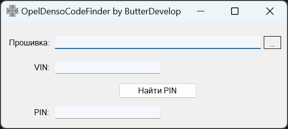

# OpenDensoCodeFinder

## Overview

**OpenDensoCodeFinder** is a powerful tool designed to search and retrieve specific codes from automotive firmware, specifically targeting Opel vehicles using Denso modules. With its intuitive graphical interface, users can effortlessly locate the necessary codes required for diagnostics, repairs, or modifications.

## Features

- **User-Friendly GUI**: Simplified interface for easy navigation and code searching.
- **Efficient Code Extraction**: Quickly processes firmware files to find relevant codes.
- **Support for Opel Vehicles**: Tailored to work with Denso modules in Opel car firmware.
- **Release Versions Available**: Access stable releases directly from the [GitHub Releases](https://github.com/ButterDevelop/OpelDensoCodeFinder/releases).

## How It Works

1. **Load Firmware File**: Select the firmware file from your Opel vehicle's Denso module.
2. **Input Search Criteria**: Enter the specific code or pattern you are looking for.
3. **Process and Retrieve**: The tool processes the file and returns the matching code if found.

## Project Structure

- **BinHexProcessor.cs**: Core logic for processing and searching firmware files.
- **GUI/**: Contains the graphical user interface components.
- **Resources/**: Image assets and other resources used in the GUI.

## Releases

Stable and pre-release versions are available on the [GitHub Releases Page](https://github.com/ButterDevelop/OpelDensoCodeFinder/releases). Download the latest version to get started quickly.

## Contributing

Contributions are welcome! Feel free to open issues or submit pull requests to enhance the functionality or fix bugs.

## License

This project is licensed under the [MIT License](./LICENSE). You are free to use, modify, and distribute this software as per the license terms.

## Contact

For any questions, suggestions, or feedback, please reach out to my GitHub account.

---
